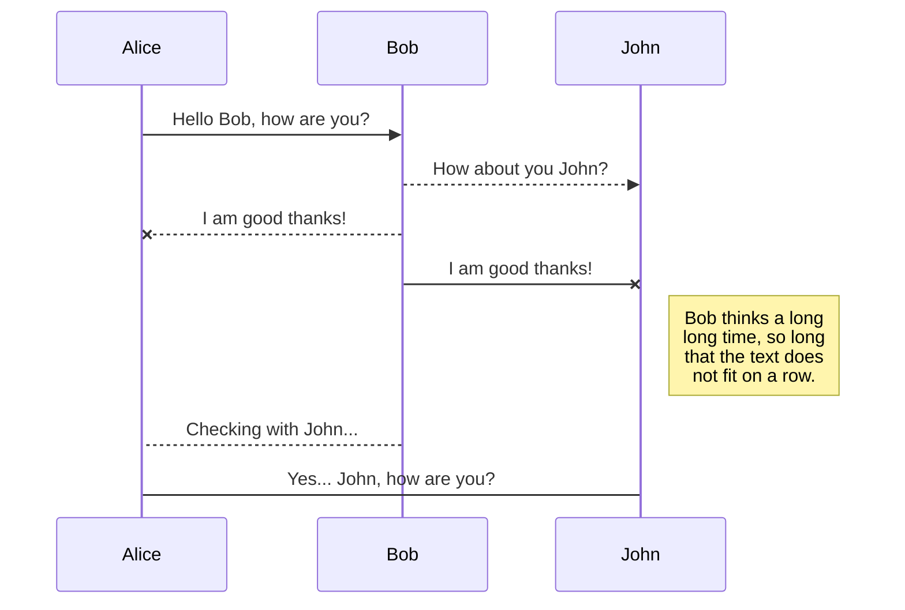
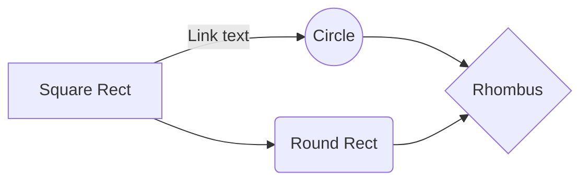

 - Static libraries

 Foundations - Low-level programming & Algorithm Hatching out

 By Julien Barbier, co-founder & CEO at Holberton School
 Resources What Is A C Library? What Is It Good For? Creating A Static C Library Using ar and ranlib ing A C Library In A Program What is difference between Dynamic and Static library(Static and Dynamic linking)

 General What is a static library, how does it work, how to create one, and how to use it Basic usage of ar, ranlib, nm

 The static library function can call a function or procedure in another static library. The linker and loader handle this the same way as for kinds of other object files. Static library files may be linked at run time by a linking loader. However, whether such a process can be called _static linking_ is controversial, the static library put together in an archive when you use it for linking, the linker will search for the library for *.o files that provide any of the missing symbols in the main program, and pull in those *.o files for linking as if they had been included on the command line like *.o files in your main program, this process is applied recursively, so if any of the *.o files pulled in from the library have unresolved symbols, the library is searched again for other *.o files that provide the definitions.

# task

The different task for to development this project

## 0.  A library is not a luxury but one of the necessities of life

Create the static library libholberton.a containing all the functions listed below:
## libholberton.a, holberton.h

## 1.  Without libraries what have we? We have no past and no future

Create a script called create_static_lib.sh that creates a static library called liball.a from all the .c files thatare in the current directory.

## create_static_lib.sh

## SmartyPants

SmartyPants converts ASCII punctuation characters into "smart" typographic punctuation HTML entities. For example:

|                |ASCII                          |HTML                         |
|----------------|-------------------------------|-----------------------------|
|Single backticks|`'Isn't this fun?'`            |'Isn't this fun?'            |
|Quotes          |`"Isn't this fun?"`            |"Isn't this fun?"            |
|Dashes          |`-- is en-dash, --- is em-dash`|-- is en-dash, --- is em-dash|

## KaTeX

You can render LaTeX mathematical expressions using [KaTeX](https://khan.github.io/KaTeX/):

The *Gamma function* satisfying $\Gamma(n) = (n-1)!\quad\forall n\in\mathbb N$ is via the Euler integral

$$
\Gamma(z) = \int_0^\infty t^{z-1}e^{-t}dt\,.
$$

> You can find more information about **LaTeX** mathematical expressions [here](http://meta.math.stackexchange.com/questions/5020/mathjax-basic-tutorial-and-quick-reference).

## UML diagrams

You can render UML diagrams using [Mermaid](https://mermaidjs.github.io/). For example, this will produce a sequence diagram:

And this will produce a flow chart:

